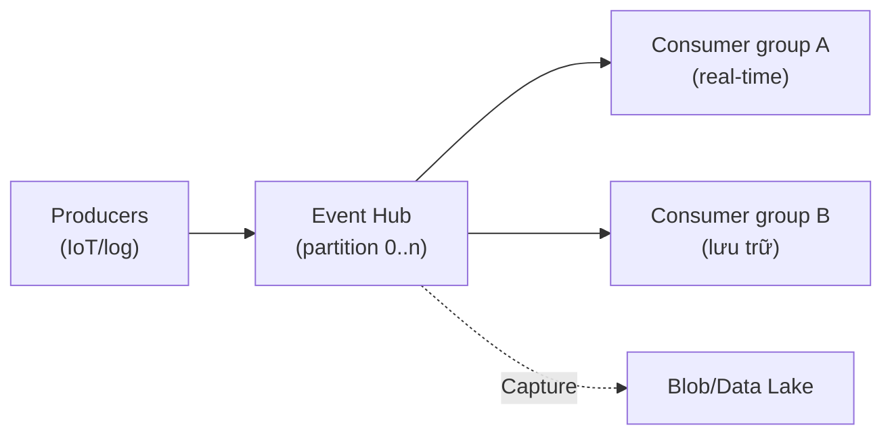

# Event-based: Event Grid & Event Hub

> [!summary] TL;DR
> Phân biệt nền tảng: **event** = thông báo *"đã có chuyện xảy ra"* (publisher **không quan tâm** ai xử lý, thường **nhẹ**); **message** = dữ liệu publisher **kỳ vọng được xử lý** (hợp đồng). **Azure Event Grid** **định tuyến event rời rạc** theo mô hình **pub/sub** (topic → subscription → handler), có sẵn event từ tài nguyên Azure (Blob created…), schema **CloudEvents**, filter, retry + dead-letter — kiểu **reactive** (kích hoạt Functions/Logic Apps khi có việc). **Azure Event Hub** chuyên **ingest luồng dữ liệu lớn** (telemetry/IoT/log, hàng triệu event/giây) qua **partition** + **consumer group** + **offset/checkpoint**, tương thích **Kafka**, có **Capture** đổ sang Blob. Quy tắc chọn: định tuyến **event rời rạc → Event Grid**; **streaming khối lượng lớn → Event Hub**; **message giao dịch/ordering → Service Bus** ([[12-Service-Bus-Queue-Storage]]).

---

## 1. Event vs Message (khái niệm nền)

| | **Event** | **Message** |
|---|---|---|
| Ý nghĩa | "Đã xảy ra X" (thông báo) | "Hãy xử lý dữ liệu này" (yêu cầu) |
| Publisher quan tâm consumer? | **Không** | **Có** (kỳ vọng xử lý) |
| Kích thước | Thường nhẹ (metadata) | Có thể nặng (payload nghiệp vụ) |
| Dịch vụ Azure | **Event Grid / Event Hub** | **Service Bus / Queue Storage** |

---

## 2. Azure Event Grid (pub/sub, định tuyến event)

- **Là gì:** dịch vụ **định tuyến event** theo **pub/sub** — publisher bắn event, Event Grid đẩy tới các **handler** đăng ký, gần real-time.

| Khái niệm | Ý nghĩa |
|---|---|
| **Topic** | Điểm publisher gửi event vào (system topic từ tài nguyên Azure, hoặc custom topic) |
| **Event subscription** | Đăng ký nhận event (kèm **filter** theo loại/đường dẫn) |
| **Event handler** | Đích xử lý: Functions, Logic Apps, Webhook, Service Bus, Storage Queue… |

- **Schema:** hỗ trợ **CloudEvents** (chuẩn mở CNCF) + Event Grid schema.
- **Độ tin cậy:** **retry** theo lịch + **dead-letter** (đẩy event giao thất bại sang Blob để xử lý sau).
- **Điển hình:** "Blob mới upload → Event Grid → Function xử lý ảnh" (reactive, không cần poll).

---

## 3. Azure Event Hub (streaming khối lượng lớn)

- **Là gì:** nền **ingest luồng big-data/telemetry** (IoT, log, click-stream) — hàng triệu event/giây.

| Khái niệm | Ý nghĩa |
|---|---|
| **Partition** | Chia luồng thành nhiều phần để **song song hóa** & giữ thứ tự trong partition |
| **Consumer group** | "Khung nhìn" độc lập của một nhóm consumer trên cùng stream → nhiều pipeline đọc song song |
| **Offset / checkpoint** | Vị trí đã đọc tới; checkpoint để **đọc tiếp đúng chỗ** sau khi restart |
| **Capture** | Tự đổ stream sang **Blob/Data Lake** (Avro) để lưu trữ/phân tích |

- Tương thích **giao thức Kafka** → app Kafka trỏ sang Event Hub không đổi code nhiều.



---

## 4. Event Grid vs Event Hub vs Service Bus (bảng chọn)

| | **Event Grid** | **Event Hub** | **Service Bus** |
|---|---|---|---|
| Loại | Event rời rạc | **Streaming** khối lượng lớn | **Message** giao dịch |
| Mô hình | Pub/sub, push tới handler | Ingest stream, consumer pull | Queue / topic-subscription |
| Hợp với | Phản ứng sự kiện (reactive) | Telemetry/IoT/log, analytics | Đơn hàng, workflow, ordering |
| Thứ tự/giao dịch | Không đảm bảo | Theo partition | **FIFO (session), transaction, DLQ** |

> [!question] Phỏng vấn: "Phân biệt event và message? Mỗi loại dùng dịch vụ nào?"
> **Event** báo "đã xảy ra", publisher không quan tâm ai xử lý (nhẹ) → **Event Grid** (rời rạc) hoặc **Event Hub** (luồng lớn). **Message** mang dữ liệu publisher kỳ vọng được xử lý (hợp đồng) → **Service Bus**/Queue Storage. Khác biệt nằm ở *kỳ vọng xử lý* và *tính giao dịch*.

> [!question] Phỏng vấn: "Khi nào chọn Event Hub thay vì Event Grid?"
> Khi cần **ingest luồng dữ liệu khối lượng rất lớn** liên tục (telemetry/IoT/log, triệu event/giây) với **partition + consumer group + checkpoint** và phân tích/streaming. Event Grid hợp **định tuyến event rời rạc** để kích hoạt xử lý (reactive), không phải ống dẫn stream lớn.

---

```
★ Insight ─────────────────────────────────────
• "Event vs message" là câu hỏi gốc rễ phân loại 3 dịch vụ: hiểu đúng
  cặp này thì tự suy ra Event Grid/Event Hub/Service Bus dùng khi nào.
• Event Grid là "chuông cửa" (báo có việc → ai đó phản ứng), Event Hub
  là "băng chuyền" (dòng dữ liệu chảy liên tục, nhiều người hứng song
  song qua consumer group).
• Consumer group + checkpoint là cách Event Hub cho nhiều pipeline đọc
  cùng stream độc lập mà không giẫm chân nhau — khác hẳn queue (một
  message một người lấy).
─────────────────────────────────────────────────
```

---

## Tự kiểm tra

1. Phân biệt **event** và **message** (kỳ vọng xử lý, kích thước, dịch vụ).
2. Event Grid: giải nghĩa **topic / subscription / handler**; retry & dead-letter làm gì?
3. Event Hub: **partition / consumer group / checkpoint** dùng để làm gì?
4. Khi nào chọn Event Grid vs Event Hub vs Service Bus?
5. **Capture** của Event Hub là gì?

---

## Liên quan
- [[00-MOC-AZ-204]]
- [[12-Service-Bus-Queue-Storage]] — message-based đối chiếu
- [[03-Azure-Functions-Bindings-Triggers]] — Functions trigger từ Event Grid/Hub
