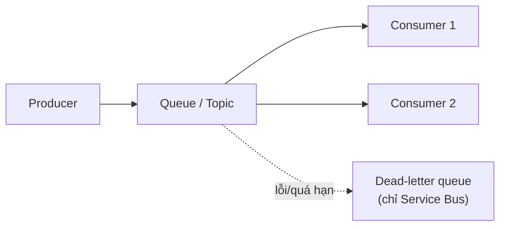

# Message-based: Service Bus & Queue Storage

> [!summary] TL;DR
> **Hàng đợi** giúp **tách rời (decouple)** producer và consumer: producer bỏ message vào queue rồi đi, consumer xử lý theo nhịp của mình → **load leveling** (đệm spike), **độ tin cậy** (retry, không mất việc), **async**. Azure có 2 lựa chọn: **Service Bus** = **enterprise messaging** đầy đủ tính năng — **queue** (point-to-point) và **topic/subscription** (pub/sub có filter), kèm **FIFO qua sessions**, **dead-letter queue (DLQ)**, duplicate detection, scheduled message, **transaction**, chế độ **peek-lock** vs receive-and-delete. **Queue Storage** = hàng đợi **đơn giản, dung lượng cực lớn, rẻ** trên Storage Account nhưng **ít tính năng** (không topic/session/transaction; message ≤ 64KB). Quy tắc chọn: cần ordering/giao dịch/pub-sub nâng cao → **Service Bus**; chỉ cần queue đơn giản, rẻ, hàng triệu message → **Queue Storage**.

---

## 1. Vì sao hàng đợi (decoupling, load leveling)

| Lợi ích | Ý nghĩa |
|---|---|
| **Decoupling** | Producer & consumer không cần online cùng lúc, không gọi trực tiếp nhau |
| **Load leveling** | Queue **đệm** lúc spike → consumer xử lý đều, backend không sập |
| **Độ tin cậy** | Message bền tới khi xử lý xong; lỗi thì **retry**, không mất việc |
| **Scale** | Thêm nhiều consumer cùng rút queue để tăng throughput |

---

## 2. Azure Service Bus (queue, topic, DLQ, session)

- **Là gì:** message broker **enterprise** đầy đủ tính năng (broker = trung gian nhận/giữ/giao message).

| Mô hình | Ý nghĩa |
|---|---|
| **Queue** | **Point-to-point**: mỗi message **một** consumer lấy |
| **Topic / Subscription** | **Pub/sub**: một message **nhân bản** tới nhiều subscription (kèm **filter rule**) |

**Tính năng nâng cao (điểm phân biệt với Queue Storage):**
- **Sessions** → đảm bảo **FIFO** (thứ tự) cho nhóm message cùng session id.
- **Dead-letter queue (DLQ)** → message lỗi/quá hạn/quá số lần thử bị đẩy sang hàng đợi chết để xử lý riêng.
- **Duplicate detection**, **scheduled message** (hẹn giờ giao), **transaction** (gộp nhiều thao tác nguyên tử).
- **Peek-lock vs receive-and-delete:**
  - **Peek-lock** (an toàn): khóa message khi xử lý; xong gọi **complete** mới xóa, lỗi thì **abandon** để giao lại → không mất việc.
  - **Receive-and-delete**: xóa ngay khi nhận (nhanh, nhưng sập là mất message).
- **Tier:** Standard vs **Premium** (tài nguyên riêng, hiệu năng ổn định, VNet).

---

## 3. Azure Queue Storage (đơn giản, dung lượng lớn)

- Hàng đợi **đơn giản** nằm trên **Storage Account**: dung lượng tới hàng TB, **rẻ**, hàng triệu message.
- Hạn chế: **không** topic/session/transaction/duplicate-detection; **message ≤ 64KB**; có **TTL** & visibility timeout (ẩn message khi đang xử lý).
- Hợp khi chỉ cần "ống đệm" công việc đơn giản, không cần ordering/giao dịch.

---

## 4. Service Bus vs Queue Storage (bảng chọn)

| Tiêu chí | **Service Bus** | **Queue Storage** |
|---|---|---|
| Loại | Enterprise broker | Queue đơn giản |
| Pub/sub (topic) | ✅ | ❌ |
| FIFO / ordering | ✅ (sessions) | ❌ |
| DLQ | ✅ | ❌ (tự xử lý) |
| Transaction / duplicate detection | ✅ | ❌ |
| Kích thước message | tới 256KB (Premium 100MB) | **≤ 64KB** |
| Dung lượng / chi phí | Đắt hơn | **Rất lớn, rẻ** |
| Chọn khi | Cần tính năng giao dịch/ordering/pub-sub | Queue đơn giản, khối lượng cực lớn |



> [!question] Phỏng vấn: "Khi nào dùng Service Bus thay vì Queue Storage?"
> Khi cần **tính năng nâng cao**: **pub/sub (topic)**, **FIFO/ordering (sessions)**, **DLQ**, **transaction**, duplicate detection, scheduled message. Queue Storage chỉ là queue đơn giản — chọn khi cần **dung lượng cực lớn, rẻ** và không cần các tính năng trên.

> [!question] Phỏng vấn: "Peek-lock khác receive-and-delete thế nào? Vì sao quan trọng?"
> **Peek-lock** khóa message khi consumer xử lý; xử lý xong gọi **complete** mới xóa, lỗi thì **abandon** để giao lại → đảm bảo **không mất việc** (at-least-once). **Receive-and-delete** xóa ngay khi nhận — nhanh nhưng nếu consumer sập giữa chừng là **mất message**.

---

```
★ Insight ─────────────────────────────────────
• Queue là "giảm xóc" giữa hệ thống: tách producer/consumer để spike
  không đánh sập backend — đây là load leveling, nền của kiến trúc
  chịu tải. Liên hệ BackgroundTasks vs message queue ở Backend.
• Service Bus vs Queue Storage = "đầy đủ tính năng vs đơn giản & rẻ".
  Câu hỏi quyết định: có cần ordering/transaction/pub-sub không?
• Peek-lock chính là cơ chế "at-least-once": complete để xác nhận,
  abandon để thử lại — bảo đảm độ tin cậy mà đề thi rất hay hỏi.
─────────────────────────────────────────────────
```

---

## Tự kiểm tra

1. 3 lợi ích của hàng đợi (gợi ý: decouple, load leveling, reliability).
2. Service Bus **queue** vs **topic/subscription** khác nhau ra sao?
3. **DLQ**, **sessions**, **transaction** giải quyết vấn đề gì?
4. **Peek-lock** vs **receive-and-delete** — đánh đổi gì?
5. Service Bus vs Queue Storage — chọn theo tiêu chí nào? Giới hạn kích thước message mỗi bên?

---

## Liên quan
- [[00-MOC-AZ-204]]
- [[11-Event-Grid-Event-Hub]] — event-based đối chiếu
- [[03-Azure-Functions-Bindings-Triggers]] — Functions trigger từ queue/Service Bus
- [[../../../02-Backend/00-MOC-Backend|MOC Backend]] — async task & queue
