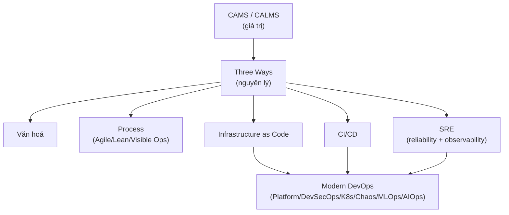

# MOC: DevOps — Foundations

> Domain DevOps — bám khoá **DevOps Foundations** (Ernest Mueller & James Wickett, LinkedIn Learning), nguồn `_shared/_source/devops`.
> ✅ Đã viết đủ **12 note** theo 6 cụm của khoá: Văn hoá → Process → IaC → CI/CD → SRE → Modern DevOps.
> ➕ Bổ sung **note 13 — Docker thực hành** (image/layer/volume/network/compose) bám sát câu hỏi phỏng vấn thực tế.
> DevOps là **mindset + thực hành** (không phải chức danh/công cụ). Trục xuyên suốt: **CAMS** (giá trị) → **Three Ways** (nguyên lý) → các practice area.

## Note

### Phần A — Nền tảng & Văn hoá
| # | Note | Nội dung | Độ khó | Trạng thái |
|---|------|----------|--------|------------|
| 1 | [[01-DevOps-Overview-Why\|DevOps là gì & Vì sao]] | Dev+Ops, **wall of confusion**, DevOps *không phải* gì, **DORA** elite vs low | ⭐⭐ | ✅ |
| 2 | [[02-CAMS-CALMS-Values\|Giá trị cốt lõi CAMS/CALMS]] | **C**ulture-**A**utomation-**M**easurement-**S**haring (+**L**ean), bẫy đo lường | ⭐⭐ | ✅ |
| 3 | [[03-The-Three-Ways\|Ba nguyên lý — The Three Ways]] | **Flow** (systems thinking) · **Feedback loops** · **Experimentation & learning** | ⭐⭐⭐ | ✅ |
| 4 | [[04-DevOps-Culture\|Văn hoá DevOps]] | Communication & **Westrum**, Collaboration & **Conway's Law**, **kaizen/gemba/PDCA** | ⭐⭐⭐ | ✅ |

### Phần B — Process
| # | Note | Nội dung | Độ khó | Trạng thái |
|---|------|----------|--------|------------|
| 5 | [[05-Agile-Lean\|Agile & Lean]] | Waterfall vs Agile, SDLC, **muda/mura/muri**, value stream, Kanban/WIP | ⭐⭐⭐ | ✅ |
| 6 | [[06-Visible-Ops-Change-Control\|Visible Ops — Change control nhẹ]] | ITSM/**ITIL**/**CAB**, 80% sự cố do change, change nhỏ + peer review + test sớm | ⭐⭐⭐ | ✅ |

### Phần C — Infrastructure as Code
| # | Note | Nội dung | Độ khó | Trạng thái |
|---|------|----------|--------|------------|
| 7 | [[07-IaC-Concepts\|IaC — khái niệm]] | provisioning/deployment/orchestration, **imperative vs declarative**, **idempotent**, **drift**, cattle-not-pets, immutable | ⭐⭐⭐ | ✅ |
| 8 | [[08-IaC-Toolchain\|IaC — toolchain]] | Terraform/Pulumi, Chef/Puppet/Ansible/Salt, **Packer**/Docker baking, K8s, testing IaC | ⭐⭐⭐⭐ | ✅ |

### Phần D — Continuous Delivery
| # | Note | Nội dung | Độ khó | Trạng thái |
|---|------|----------|--------|------------|
| 9 | [[09-CI-CD-Continuous-Deployment\|CI / CD / Continuous Deployment]] | CI 6 practices (**trunk-based**, feature flag), CD 5 practices, test pyramid/QA, **Blue-Green/Canary/A-B**, CI toolchain | ⭐⭐⭐⭐ | ✅ |

### Phần E — Site Reliability Engineering
| # | Note | Nội dung | Độ khó | Trạng thái |
|---|------|----------|--------|------------|
| 10 | [[10-SRE-Reliability\|SRE — Building for Reliability]] | reliability/resilience, **Circuit Breaker**/cascading failure, 12-factor, **SLI/SLO/SLA**, **error budget**, toil | ⭐⭐⭐⭐ | ✅ |
| 11 | [[11-Observability-Incident-Response\|Observability & Incident Response]] | 5 vùng observability, **APM/RUM/tracing**, ICS, **blameless postmortem** | ⭐⭐⭐⭐ | ✅ |

### Phần F — Modern DevOps
| # | Note | Nội dung | Độ khó | Trạng thái |
|---|------|----------|--------|------------|
| 12 | [[12-Modern-DevOps\|DevOps hiện đại]] | **Platform engineering** (paved road), **DevSecOps** (shift left), **Cloud native/K8s**, **Chaos engineering**, **MLOps**, **AIOps**, career | ⭐⭐⭐⭐ | ✅ |

### Phần G — Docker thực hành (bổ sung theo đề phỏng vấn)
| # | Note | Nội dung | Độ khó | Trạng thái |
|---|------|----------|--------|------------|
| 13 | [[13-Docker-Practical\|Docker thực hành]] | **image vs container**, **layer & build cache**, **Alpine** (musl vs glibc), **`.dockerignore`**, **port mapping** `-p`, **bind mount vs named volume**, **docker-compose** & tên service (DNS) | ⭐⭐⭐ | ✅ |

## Bản đồ khái niệm

## Liên quan (cross-domain)
- [[00-Foundations/03-Agile-Scrum/00-MOC-Agile-Scrum|MOC: Agile-Scrum]] — Agile/Lean process chi tiết
- [[00-Foundations/02-Git/12-CI-CD-la-gi|Git: CI/CD]] · [[00-Foundations/02-Git/13-GitHub-Actions|GitHub Actions]] — CI/CD thực hành
- [[02-Backend/16-Production-Streaming-Scaling|Backend: Production & Scaling]] — observability, rate limiting
- [[02-Backend/09-Authorization-RBAC|Backend: OWASP & security]] — nền DevSecOps
- [[04-AI/03-LLMOps-Evaluation/00-MOC-LLMOps-Evaluation|MOC: LLMOps]] — họ hàng MLOps
- [[05-Cloud/00-MOC-Cloud|MOC: Cloud]] — nền cloud native / IaC
- [[00-INDEX|🏠 Index tổng]]
