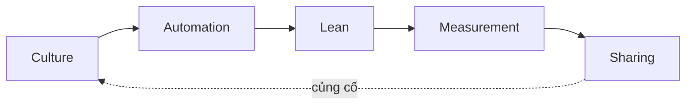

# Giá trị cốt lõi DevOps — CAMS / CALMS

> [!summary] TL;DR
> **CAMS** (John Willis & Damon Edwards) là bộ giá trị nền tảng của DevOps: **C**ulture, **A**utomation, **M**easurement, **S**haring. **Culture** đứng đầu — DevOps về bản chất là *"vấn đề con người"* (Patrick Debois). **Automation** là chất xúc tốc giúp mở khoá các lợi ích khác, nhưng *nhảy thẳng vào automation mà bỏ qua văn hoá là cách thất bại phổ biến nhất*. **Measurement** đo đúng **outcome** (MTTR, cycle time, chi phí, cả sự hài lòng nhân viên), tránh đo sai/đặt thưởng sai. **Sharing** là trái tim của cộng tác (tài liệu, pair programming, peer review, mentoring). Jez Humble đề xuất thêm **L**ean → thành **CALMS** (loại bỏ lãng phí).

---

## 1. CAMS — 4 chữ cái

| Chữ | Ý nghĩa | Điểm mấu chốt |
|---|---|---|
| **C** Culture | Văn hoá, hành vi con người | Đứng **đầu tiên** — DevOps là "human problem". Không phải bàn ping-pong hay đồ ăn free, mà là **hành vi** & hiểu nhau giữa các nhóm |
| **A** Automation | Tự động hoá | Chất xúc tốc; loại bỏ lãng phí từ thao tác tay. **Nhưng** làm sau khi hiểu văn hoá — nhảy thẳng vào tool là cách thất bại số 1 |
| **M** Measurement | Đo lường | Đo để biết điều gì đang xảy ra & thay đổi có cải thiện không. 2 bẫy: **đo sai thứ** và **đặt thưởng/incentive sai** |
| **S** Sharing | Chia sẻ | Trái tim của cộng tác: documentation, pair programming, peer review, mentoring, inclusion → ai cũng mạnh hơn |

> [!warning] Bẫy kinh điển: lao vào Automation trước
> Điều người ta nghĩ đến đầu tiên khi nghe "DevOps" thường là automation/công cụ. Nhưng **bỏ thời gian cho các giá trị còn lại** (nhất là Culture) rồi mới automation mới đúng. *Tự động hoá một quy trình tồi chỉ cho ra sự hỗn loạn nhanh hơn.*

---

## 2. Đo lường đúng — Measurement

DevOps khuyên đo **outcome xuyên tổ chức**, không phải chỉ số cục bộ:

| Loại metric | Ví dụ tốt |
|---|---|
| Tốc độ phục hồi | **MTTR** — mean time to restore service sau sự cố |
| Tốc độ giao hàng | **Cycle time** để deploy một tính năng mới |
| Kết quả kinh doanh | chi phí, doanh thu |
| Con người | **mức hài lòng nhân viên** (chống burnout) |

> [!note] Hai bẫy của metric
> (1) **Đo nhầm thứ** — chọn chỉ số dễ đo nhưng không phản ánh giá trị. (2) **Incentive sai** — thưởng theo metric khiến người ta tối ưu metric thay vì kết quả thật (vd thưởng "số dòng code" → code phình to vô ích). Các metric DORA (deploy frequency, lead time, change failure rate, MTTR) là ví dụ đo *outcome* tốt → [[01-DevOps-Overview-Why]].

---

## 3. CAMS → CALMS (thêm Lean)

Jez Humble đề xuất chèn **L = Lean** vào CAMS → **CALMS**, nhấn mạnh **loại bỏ lãng phí (waste)** và tối ưu *value stream*. John Willis đồng tình mạnh đến mức viết hẳn một cuốn sách về Deming (cha đẻ tư duy chất lượng/Lean).



→ Chi tiết Lean (muda/muri/mura, value stream) ở [[05-Agile-Lean]].

> [!question] Phỏng vấn: "CAMS gồm gì? Vì sao Culture đứng đầu mà không phải Automation?"
> **C**ulture, **A**utomation, **M**easurement, **S**haring. Culture đứng đầu vì DevOps về bản chất là *vấn đề con người* — automation chỉ là **chất xúc tốc**, nó khuếch đại cái đang có. Nếu văn hoá còn silo/đổ lỗi, tự động hoá chỉ làm hỗn loạn xảy ra nhanh hơn. Thực tế, *nhảy vào automation mà bỏ qua văn hoá là nguyên nhân thất bại DevOps phổ biến nhất.* (CALMS = thêm Lean để nhấn loại bỏ lãng phí.)

> [!question] Phỏng vấn: "Đo lường trong DevOps có rủi ro gì?"
> Hai bẫy: **đo sai thứ** (chỉ số dễ đo nhưng vô nghĩa) và **đặt incentive sai** (thưởng theo metric → người ta gaming metric). Nên đo **outcome** xuyên tổ chức (MTTR, cycle time, chi phí, cả sự hài lòng nhân viên) thay vì đầu ra cục bộ của một team.

```
★ Insight ─────────────────────────────────────
• Thứ tự CAMS có chủ đích: Culture trước, Automation sau. Đảo thứ tự (mua tool
  trước, sửa văn hoá sau) là antipattern được lặp lại ở vô số tổ chức thất bại.
• Automation là "đòn bẩy", không phải "mục tiêu" — nó nhân lên cả điều tốt lẫn
  điều xấu của hệ thống hiện có.
• Measurement & Sharing là cặp song sinh của feedback loop: đo để biết, chia sẻ
  để cả tổ chức cùng học. Đây chính là cầu nối CAMS → Three Ways.
─────────────────────────────────────────────────
```

---

## 4. Tự kiểm tra

1. CAMS viết tắt của những từ nào? Chữ nào quan trọng nhất và vì sao?
2. Vì sao "lao vào automation trước" là cách thất bại phổ biến?
3. Hai bẫy của Measurement là gì? Cho ví dụ incentive sai.
4. CALMS thêm chữ nào so với CAMS? Nó nhấn mạnh điều gì?
5. Kể 3 hình thức "Sharing" trong DevOps.

---

## 5. Liên quan
- [[01-DevOps-Overview-Why]] — DevOps là gì, DORA metrics
- [[03-The-Three-Ways]] — nguyên lý biến giá trị CAMS thành hành động
- [[05-Agile-Lean]] — Lean (chữ L trong CALMS), muda/muri/mura
- [[11-Observability-Incident-Response]] — Measurement trong thực tế (observability)
- [[00-MOC-DevOps|MOC: DevOps]]
