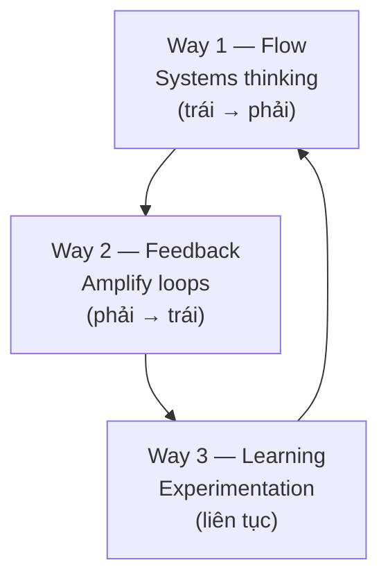

# Ba nguyên lý DevOps — The Three Ways

> [!summary] TL;DR
> **The Three Ways** (Gene Kim — *The Phoenix Project*, *The DevOps Handbook*; Mike Orzen — *Lean IT*) là bộ nguyên lý biến giá trị **CAMS** thành hành động. **Way 1 — Systems thinking & Flow:** tối ưu **toàn hệ thống** (concept → cash), không tối ưu cục bộ một khâu; chú ý bottleneck dịch chuyển và friction ở các handoff. **Way 2 — Amplify feedback loops:** tạo, rút ngắn, khuếch đại **feedback loop** giữa các khâu — bắt lỗi càng sớm càng rẻ. **Way 3 — Continuous experimentation & learning:** văn hoá thử nghiệm, học từ thực hành & thất bại, luyện tập lặp lại để thành thạo (gốc rễ từ **kaizen**).

---

## 1. Tổng quan ba con đường



| | Tên | Hướng | Câu hỏi cốt lõi |
|---|---|---|---|
| **Way 1** | Systems thinking & Flow | trái → phải (Dev → Ops → User) | Toàn bộ luồng giá trị có chảy mượt không? |
| **Way 2** | Amplify feedback loops | phải → trái (production → Dev) | Phản hồi có nhanh & mạnh để sửa sớm không? |
| **Way 3** | Continuous experimentation & learning | vòng lặp liên tục | Ta có dám thử, học, lặp lại không? |

---

## 2. Way 1 — Systems thinking & Flow

Tập trung vào **kết quả của TOÀN hệ thống**, không tối ưu một phần gây hại tổng thể.

- **Bottleneck dịch chuyển:** tăng hiệu năng một chỗ làm nghẽn dồn sang chỗ khác (thêm app server → DB cạn connection → sập). Phải hiểu cả hệ thống mới tối ưu đúng.
- **Local vs global optimization:** một team làm "đẹp số" của mình nhưng làm hỏng luồng giao hàng chung. *"Viết được mọi phần mềm trên đời mà không giao được cho khách dùng → bạn thua."*
- **Handoff & friction:** ranh giới giữa các nhóm (concept → cash) là nơi flow hay hỏng.

> [!question] Phỏng vấn: "Vì sao tối ưu một khâu lại có hại? Cho ví dụ."
> Vì hệ thống là chuỗi liên kết — tối ưu cục bộ (local optimization) thường đẩy bottleneck sang khâu khác hoặc làm hỏng flow tổng thể. Ví dụ: team deploy lập quy trình cho *số liệu của họ* đẹp nhưng làm chậm cả luồng phát triển; hoặc thêm app server làm DB cạn connection pool rồi sập. Way 1 dạy phải dùng **systems thinking** khi định nghĩa metric thành công và đánh giá thay đổi — tối ưu **flow từ concept → cash**.

---

## 3. Way 2 — Amplify feedback loops

**Feedback loop** = quy trình lấy chính output của nó để quyết định bước tiếp (gốc từ control systems). Loop ngắn & hiệu quả là chìa khoá. Câu chuyện một con bug minh hoạ chi phí tăng theo độ trễ phát hiện:

| Bug bị bắt ở đâu | Chi phí (thời gian/tiền) |
|---|---|
| Unit test trên máy dev (trước khi commit) | **Rẻ nhất** — gần như không lãng phí |
| QA bắt → log ticket → đẩy lại dev | Lãng phí hơn |
| Lọt tới khách hàng → support → escalate → product manager reprioritize → fix | **Đắt nhất** — cùng (hoặc tệ hơn) kết quả |

→ Đây là nền tảng lý thuyết của **CI/CD** ([[09-CI-CD-Continuous-Deployment]]) và **shift left** trong DevSecOps ([[12-Modern-DevOps]]).

---

## 4. Way 3 — Continuous experimentation & learning

Tạo văn hoá **thử nghiệm + học**, thay vì "analysis paralysis". Hai vế:
1. **Thử cái mới** — chủ động thử để biết cái gì hoạt động, điều chỉnh & lặp.
2. **Luyện cái đã có** — thành thạo kỹ năng/công cụ qua lặp lại.

Các câu cửa miệng phản ánh văn hoá này: *"working code wins"*, *"if it hurts, do it more often"*, *"fail fast"*. Gốc rễ là **kaizen** (cải tiến liên tục) → chi tiết ở [[04-DevOps-Culture]].

> [!question] Phỏng vấn: "Three Ways gồm những gì? Mỗi cái chạy theo hướng nào?"
> **Way 1 — Flow** (systems thinking): tối ưu toàn hệ thống, hướng trái→phải (Dev→Ops→User). **Way 2 — Feedback**: tạo & khuếch đại feedback loop, hướng phải→trái (production→Dev), bắt lỗi sớm vì càng sớm càng rẻ. **Way 3 — Continuous experimentation & learning**: văn hoá thử nghiệm, học từ thất bại, luyện tập lặp lại. Câu chốt: *Way 1 lo luồng đi tới, Way 2 lo phản hồi đi lui, Way 3 lo tổ chức biết học.*

```
★ Insight ─────────────────────────────────────
• Three Ways là CƠ CHẾ biến CAMS (giá trị) thành thực hành cụ thể: Flow ↔ Lean,
  Feedback ↔ Measurement, Learning ↔ Culture/Sharing.
• Chi phí sửa lỗi tăng theo CẤP SỐ NHÂN với độ trễ phát hiện — đây là lý do kinh
  tế (không phải lý tưởng) khiến "shift left" và test sớm luôn thắng.
• Hai con đường đầu là kỹ thuật-quy trình; con đường thứ ba là VĂN HOÁ — và nó
  khó nhất, vì đòi hỏi tổ chức chấp nhận thất bại như nguồn học, không phải để đổ
  lỗi (→ blameless postmortem).
─────────────────────────────────────────────────
```

---

## 5. Tự kiểm tra

1. Three Ways do ai đề xuất? Liệt kê tên & hướng của từng con đường.
2. "Bottleneck dịch chuyển" nghĩa là gì? Cho một ví dụ.
3. Vì sao bug bắt ở unit test rẻ hơn nhiều so với bắt ở khách hàng?
4. Way 3 bắt nguồn từ khái niệm Nhật nào? Kể 3 câu cửa miệng phản ánh nó.
5. Ánh xạ mỗi Way với một chữ trong CAMS.

---

## 6. Liên quan
- [[02-CAMS-CALMS-Values]] — giá trị mà Three Ways hiện thực hoá
- [[04-DevOps-Culture]] — kaizen, gemba (nền của Way 3)
- [[09-CI-CD-Continuous-Deployment]] — Way 1 & 2 trong pipeline
- [[12-Modern-DevOps]] — shift left (DevSecOps), chaos engineering (Way 3)
- [[00-MOC-DevOps|MOC: DevOps]]
