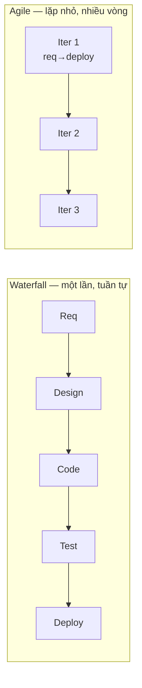

# Process foundations — Agile & Lean

> [!summary] TL;DR
> Hai nền tảng quy trình của DevOps. **Agile**: thay vì **Waterfall** (làm từng pha đầy đủ rồi ném qua tường), ta lặp qua toàn bộ SDLC theo **iteration nhỏ**, cộng tác liên tục, feedback mỗi vòng. Agile *thiếu* nhắc đến Ops/hệ thống → DevOps mở rộng Agile sang vận hành. **Lean** (Toyota Production System, Deming & Ohno): quy trình **loại bỏ lãng phí (waste)**. Ba loại waste: **muda** (không tạo giá trị), **mura** (luồng bất thường), **muri** (quá tải). Công cụ Lean: **value stream mapping** (concept→cash), **Kanban** (trực quan hoá công việc), **WIP limit** (giới hạn việc dở dang), **build-measure-learn** (Lean Startup). Lean quan trọng đến mức Jez Humble thêm L vào CAMS → **CALMS**.

---

## 1. Agile — lặp thay vì thác nước

**SDLC** (Software Development Life Cycle): Requirements → Design → Implement → Test → Deploy → Maintain.



| | Waterfall | Agile |
|---|---|---|
| Cách chạy | mỗi pha **xong hẳn** rồi ném qua tường | lặp toàn bộ SDLC theo **iteration nhỏ** |
| Feedback | đến **rất muộn**, khó sửa | mỗi vòng → dùng cho vòng sau |
| Rủi ro | mất ngữ cảnh & chất lượng mỗi handoff | phát hiện sớm, sửa rẻ |

> [!note] Agile ≠ DevOps
> Có thể làm DevOps không cần Agile và ngược lại, **nhưng** DevOps nên là **phần mở rộng của Agile**. Agile Manifesto (2001) *không nhắc* tới **Operations** và phần **systems** (dựng hạ tầng, deploy, monitor) — vì thời đó chưa quen đưa sysadmin vào product team. Phần mềm nay chủ yếu là dịch vụ → Ops trở thành phần thiết yếu → DevOps lấp khoảng trống đó. → Chi tiết Scrum/Agile ở [[00-Foundations/03-Agile-Scrum/01-Tong-quan-Agile-Scrum]].

---

## 2. Lean — loại bỏ lãng phí

Lean = quy trình **có hệ thống để loại bỏ waste** (gốc: Toyota Production System của Deming & Taiichi Ohno; Poppendieck đưa vào software 2003; Eric Ries → *Lean Startup*).

### 2.1. Ba loại lãng phí (3M)

| Loại | Nghĩa | Ví dụ |
|---|---|---|
| **Muda** (vô ích) | hoạt động **không tạo giá trị** | *Type 1*: cần nhưng không tạo giá trị (điền timesheet) · *Type 2*: thừa hoàn toàn |
| **Mura** (bất thường) | waste do **luồng không đều** → delay, chờ đợi | hàng dồn cục rồi nghẽn |
| **Muri** (quá tải) | waste do **quá tải** → mệt mỏi, hỏng hóc | ép người/máy chạy quá sức |

Poppendieck định nghĩa **7 loại waste** trong software (bug, delay, làm tính năng không cần…). Mẹo: nhận ra việc nào là *muda type 1* để **giảm tối đa & tự động hoá** nó.

### 2.2. Công cụ Lean

| Công cụ | Mục đích |
|---|---|
| **Value stream mapping** | vẽ toàn pathway tạo giá trị (**concept → cash**), thấy giá trị thêm ở đâu, mất thời gian/waste ở đâu |
| **Kanban board** | trực quan hoá công việc qua các pha (Post-it/Trello) |
| **WIP limit** | giới hạn số việc *bắt đầu mà chưa xong* → giảm waste |
| **Build-Measure-Learn** | (Lean Startup) giao **MVP** → lấy feedback → lặp, thay vì phân tích "sản phẩm hoàn hảo" trước |

> [!warning] WIP cao là nguy hiểm
> Code "nằm chờ" chưa giao = đang sinh **rủi ro và lãng phí** (Way 2). Giới hạn WIP buộc ta hoàn thành trước khi bắt việc mới → flow mượt hơn. Liên hệ trực tiếp với "commit nhỏ" trong CI → [[09-CI-CD-Continuous-Deployment]].

> [!question] Phỏng vấn: "Phân biệt muda, mura, muri."
> Cả ba là loại waste trong Lean. **Muda** = hoạt động không tạo giá trị (type 1 cần nhưng vô giá trị như điền form; type 2 thừa hoàn toàn). **Mura** = waste do **luồng bất thường/không đều** gây delay & chờ. **Muri** = waste do **quá tải** gây mệt mỏi & hỏng hóc. Mẹo nhớ: muda = *phí*, mura = *gập ghềnh*, muri = *quá sức*.

> [!question] Phỏng vấn: "Vì sao Agile Manifesto chưa đủ cho DevOps?"
> Agile (2001) tập trung vào *working software* và cộng tác trong phát triển, nhưng **không nhắc Operations** lẫn phần **systems** (hạ tầng, deploy, monitor, maintain). Khi phần mềm trở thành **dịch vụ** chạy 24/7, vận hành là phần thiết yếu của giá trị. DevOps mở rộng Agile để bao gồm Ops và toàn vòng đời tới production — nên DevOps thường được triển khai *như phần mở rộng của Agile*.

```
★ Insight ─────────────────────────────────────
• Agile và Lean bổ sung nhau: Agile lo "lặp nhỏ + feedback", Lean lo "cắt waste +
  tối ưu value stream". Three Ways của DevOps thực chất là Agile+Lean gói lại.
• WIP cao = tồn kho code chưa giao = rủi ro ẩn. Đây là cầu nối khái niệm giữa Lean
  (giảm tồn kho) và CI (commit nhỏ, deploy thường xuyên).
• "Concept to cash" là thước đo Lean cho TOÀN luồng — trùng khớp với cycle time
  của CI/CD và với Way 1 (flow). Cùng một ý tưởng nhìn từ ba góc.
─────────────────────────────────────────────────
```

---

## 3. Tự kiểm tra

1. Waterfall khác Agile ở cách chạy và thời điểm feedback như thế nào?
2. Vì sao Agile Manifesto chưa bao phủ Ops/systems?
3. Phân biệt muda / mura / muri. Muda có mấy type?
4. Value stream mapping đo gì? "Concept to cash" nghĩa là gì?
5. Vì sao WIP cao là nguy hiểm? WIP limit giúp gì?

---

## 4. Liên quan
- [[06-Visible-Ops-Change-Control]] — building block process thứ ba (change control)
- [[03-The-Three-Ways]] — flow & feedback (gốc Lean/Agile)
- [[09-CI-CD-Continuous-Deployment]] — commit nhỏ, giảm WIP trong pipeline
- [[00-Foundations/03-Agile-Scrum/01-Tong-quan-Agile-Scrum]] — Scrum/Agile chi tiết
- [[00-Foundations/03-Agile-Scrum/06-Technical-Debt]] — nợ kỹ thuật (một dạng waste)
- [[00-MOC-DevOps|MOC: DevOps]]
