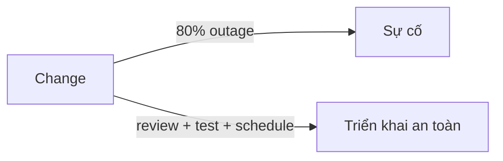

# Visible Ops — Change control nhẹ

> [!summary] TL;DR
> **Change là nguyên nhân số 1 gây sự cố** — ~80% outage đến từ một thay đổi ai đó đang thực hiện. Cách giảm rủi ro là **kiểm soát thay đổi**. **ITSM** (IT Service Management) ra đời thập niên 1980; framework phổ biến nhất là **ITIL** (34 lĩnh vực) — nhưng ITIL hay tạo quy trình **nặng nề, chậm**: mọi change phải viết dài, gửi **CAB** (Change Advisory Board) gồm những người *ít hiểu chi tiết kỹ thuật nhất* duyệt. Gene Kim et al. viết **The Visible Ops Handbook** (112 trang vs ITIL >2000 trang): change control **nhẹ, nhanh, có thể lặp & audit**. Ba nguyên tắc: (1) mọi change vẫn cần review/approve/document nhưng đa số chỉ cần **peer review**, change rủi ro cao mới escalate; (2) **change càng nhỏ càng tốt**; (3) **test sớm nhất có thể** (CI + automated test).

---

## 1. Vì sao cần change control?

Hệ thống đôi khi tự hỏng, nhưng **~80% sự cố** đến từ một **change** (vá, nâng cấp, cải tiến) bị sai. ⇒ Cách hiển nhiên để giảm rủi ro: **review, test, lên lịch rollout** cho thay đổi.



---

## 2. ITSM / ITIL và vấn đề của nó

**ITSM** = quản lý & hỗ trợ dịch vụ IT cũng quan trọng như phát triển nó (ra đời thập niên 1980). Nhiều framework hiện thực: Microsoft Operations Framework, COBIT, ISO 20000, Six Sigma — nhưng phổ biến nhất là **ITIL** (IT Infrastructure Library, nay v4, ~34 lĩnh vực, 5 cuốn >2000 trang).

> [!warning] ITIL change management dễ thành "nặng"
> Tập trung vào **viết tay từng change** rồi gửi **CAB (Change Advisory Board)** duyệt/từ chối. Vấn đề: với số lượng change của tổ chức hiện đại, cách này **cực chậm**, và đặt quyền quyết định vào tay những người **ít đủ năng lực kỹ thuật nhất** để đánh giá rủi ro của một thay đổi cụ thể. Khi có sự cố, phản ứng ITIL thường là *thêm process & delay* — càng làm chậm.

---

## 3. Visible Ops — change control nhẹ

Gene Kim (đồng tác giả Tripwire, sau này tạo Three Ways), Kevin Behr, George Spafford nghiên cứu các tổ chức IT hiệu suất cao → **The Visible Ops Handbook** (2004), chỉ **112 trang**. Cốt lõi: **lightweight, fast, scalable, repeatable, auditable** change control. Nghiên cứu DORA xác nhận: **streamlined change approval** → hiệu suất cao hơn, ít burnout hơn, tăng psychological safety.

### Ba nguyên tắc

| # | Nguyên tắc | Chi tiết |
|---|---|---|
| **1** | Review theo **mức rủi ro** | Mọi change vẫn cần review/approve/document. Nhưng **đa số** chỉ cần **peer review** bởi một kỹ thuật viên gần team. Change vào hệ thống *fragile* hoặc có *tác động rộng* mới escalate lên cross-functional |
| **2** | **Change nhỏ** | Dễ review; nếu lỗi, rollout từng change nhỏ giúp **tìm & sửa** dễ hơn nhiều so với batch hàng trăm thay đổi |
| **3** | **Test sớm nhất** | Lý tưởng dùng **CI + automated test** để mỗi change có validation khách quan; peer review kiểm rằng việc test đã diễn ra; security safeguard cài sẵn vào platform, chạy sớm |

> Ví dụ phân loại rủi ro: lắp một wireless access point mới → **rủi ro thấp** → review nhẹ. Thay core campus router → **rủi ro cao** → review kỹ.

> [!question] Phỏng vấn: "CAB của ITIL có vấn đề gì? Visible Ops khắc phục thế nào?"
> CAB (Change Advisory Board) duyệt mọi change qua một hội đồng — **chậm** và trao quyết định cho người **ít hiểu chi tiết kỹ thuật nhất**. Visible Ops thay bằng change control **nhẹ**: đa số change chỉ cần **peer review** bởi kỹ thuật viên gần team; chỉ change rủi ro cao mới escalate; ưu tiên **change nhỏ** và **test tự động sớm** (CI). Kết quả (DORA xác nhận): nhanh hơn, an toàn hơn, ít burnout hơn.

> [!question] Phỏng vấn: "Bao nhiêu % sự cố đến từ change? Hệ quả là gì?"
> Khoảng **80%** outage đến từ một change đang được thực hiện. Hệ quả: kiểm soát thay đổi là đòn bẩy lớn nhất để giảm sự cố — nhưng phải **nhẹ** (peer review, change nhỏ, test sớm) chứ không phải nặng (CAB, viết tay dài dòng), vì process nặng làm chậm flow mà không tăng an toàn tương xứng.

```
★ Insight ─────────────────────────────────────
• Nghịch lý: process kiểm soát NẶNG không làm hệ thống an toàn hơn — nó làm chậm
  flow và đẩy quyết định tới người ít hiểu nhất. An toàn thật đến từ change NHỎ +
  test SỚM + peer review (đúng tinh thần Way 2).
• Visible Ops chính là cầu nối process → CI/CD: "change nhỏ, test sớm, review bởi
  người gần việc" là mô tả chính xác của một pipeline CI tốt.
• 112 trang vs 2000 trang là một tuyên ngôn Lean: cắt waste ngay cả trong... tài
  liệu quy trình.
─────────────────────────────────────────────────
```

---

## 4. Tự kiểm tra

1. Bao nhiêu phần trăm sự cố đến từ change? Ba việc cần làm với mỗi change?
2. ITSM là gì? ITIL là gì? Vì sao change management kiểu ITIL dễ thành nặng nề?
3. CAB là gì và nhược điểm của nó?
4. Ba nguyên tắc của Visible Ops change control là gì?
5. Cho ví dụ một change rủi ro thấp và một change rủi ro cao.

---

## 5. Liên quan
- [[05-Agile-Lean]] — hai building block process còn lại (Agile, Lean)
- [[09-CI-CD-Continuous-Deployment]] — test sớm, change nhỏ trong pipeline
- [[03-The-Three-Ways]] — feedback loop (Way 2)
- [[00-Foundations/02-Git/05-Branch-Merge-PR]] — peer review qua Pull Request
- [[00-MOC-DevOps|MOC: DevOps]]
