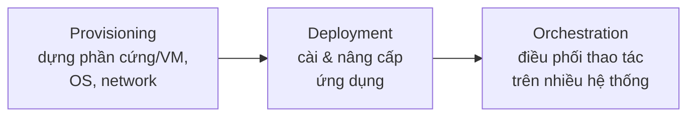

# Infrastructure as Code — khái niệm cốt lõi

> [!summary] TL;DR
> **IaC** = tạo & quản lý hạ tầng (server, storage, network) bằng **code** thay vì thao tác tay — đưa code vào source control, qua build/test/deploy như phần mềm. Nó hiện thực chữ **A** (Automation) trong CAMS. Configuration management có 3 phần: **provisioning** (dựng hạ tầng sẵn sàng) → **deployment** (cài/nâng app) → **orchestration** (điều phối thao tác trên nhiều hệ thống). Bốn khái niệm phải thuộc: **imperative** (procedural — ra lệnh từng bước) vs **declarative** (functional — mô tả trạng thái mong muốn, tool tự hội tụ); **idempotent** (chạy nhiều lần ra cùng kết quả); **drift** (hệ thống thật trôi khỏi định nghĩa). Triết lý: **cattle not pets** & **immutable infrastructure** (không sửa, chỉ destroy & tạo lại).

---

## 1. IaC là gì & vì sao?

Xưa: dựng hạ tầng **thủ công** — mỗi server là một "snowflake" (bông tuyết độc nhất), chậm và dễ lỗi, càng vá càng khác nhau. Nay hạ tầng có **lớp phần mềm cấu hình phần cứng** → **lập trình được**.

> [!note] Định nghĩa
> **Infrastructure as Code** = *provisioning và quản lý hạ tầng bằng cách viết code tự động hoá, thay vì quy trình thủ công.* Lợi ích: reproducibility (tái lập), self-service, scaling nhanh. Thách thức lớn nhất **không** phải kỹ thuật mà là **đổi tư duy**: từ "tôi bấm tay" sang "dùng vòng đời phát triển phần mềm" cho hạ tầng. Hiện thực chữ **A** trong [[02-CAMS-CALMS-Values|CAMS]].

---

## 2. Ba phần của Configuration Management

**Configuration management** = quy trình tạo & giữ hệ thống ở **trạng thái mong muốn** (desired state), trong DevOps là tự động & điều khiển bằng code.



| Phần | Định nghĩa | Ví dụ |
|---|---|---|
| **Provisioning** | làm server & hạ tầng nền **sẵn sàng hoạt động** | tạo VM, cài OS, system services, kết nối mạng |
| **Deployment** | tự động **cài/nâng cấp app** trên hệ thống đó | rollout phiên bản mới (kể cả phần mềm bên thứ ba) |
| **Orchestration** | **điều phối** thao tác phối hợp trên nhiều hệ thống | automated failover, rolling deployment, chạy runbook trên cả fleet |

> Ví von: *provision phần cứng → deploy ứng dụng → orchestration làm dịch vụ sống dậy như tia sét hồi sinh quái vật Frankenstein.*

---

## 3. Bốn khái niệm cốt lõi (hay hỏi)

| Khái niệm | Nghĩa | Ghi chú |
|---|---|---|
| **Imperative** (procedural) | định nghĩa **các lệnh** để tạo trạng thái, rồi chạy | "stop service → copy binary nginx mới → start service" |
| **Declarative** (functional) | định nghĩa **trạng thái mong muốn**, tool tự hội tụ hệ thống về đó | "server này phải chạy nginx 1.24" — thường là lớp bọc thân thiện trên imperative |
| **Idempotent** | chạy **lặp lại** vẫn ra **cùng** trạng thái | chạy lần 2 không làm hỏng; declarative thường idempotent sẵn, imperative thì *bạn* phải tự lo |
| **Drift** | hệ thống thật **trôi khỏi** định nghĩa | do sửa tay ngoài tool / script chạy lệch; tool tốt có **drift detection** |

> [!tip] Self-service — bước nhảy giá trị
> Từ *thủ công → tự động* đã cho reproducibility & chất lượng; nhưng bước tiếp **self-service** (người dùng tự kích hoạt, không cần qua người khác) mới giúp Ops **rời khỏi đường găng** và tăng vọt velocity. → [[12-Modern-DevOps]] (platform engineering).

---

## 4. Cattle not Pets & Immutable Infrastructure

| Mô hình | Ẩn dụ | Ý nghĩa |
|---|---|---|
| **Pets** (thú cưng) | đặt tên, chăm sóc, sửa từng con | server thủ công, độc nhất — cách cũ |
| **Cattle** (gia súc) | quản theo đàn, hỏng thì thay | server tạo hàng loạt từ code — cách DevOps |
| **Immutable infrastructure** | xây xong **không sửa** | hỏng/cần đổi → **destroy & tạo mới** từ image/container, không vá tại chỗ |

**Golden image vs Foil ball** (Luke Kanies, founder Puppet, 2009): chỉ quản bằng **image dựng sẵn** dẫn đến *image sprawl* & drift ("cục giấy bạc vo lại"). Giải pháp: **stem cell** — image nền tối thiểu, rồi **declarative CM tool idempotent** chạy tăng dần để hoàn thiện & chống drift. Sau này container hồi sinh golden image theo kiểu **immutable** (Netflix: build image đầy đủ, không đổi, chỉ thay mới).

> [!question] Phỏng vấn: "Imperative khác declarative thế nào? Idempotent nghĩa là gì?"
> **Imperative** (procedural): bạn viết **các bước lệnh** để đạt trạng thái (stop → copy → start). **Declarative** (functional): bạn mô tả **trạng thái mong muốn** ("nginx 1.24"), tool tự **hội tụ** hệ thống về đó. **Idempotent**: chạy quy trình **nhiều lần vẫn ra cùng một trạng thái** — chạy lần 2 không phá vỡ. Declarative thường idempotent sẵn; với imperative thì bạn phải tự đảm bảo. Đây là lý do declarative+idempotent được ưa chuộng cho IaC.

> [!question] Phỏng vấn: "'Cattle not pets' và immutable infrastructure nghĩa là gì?"
> **Pets** = server thủ công, độc nhất, được "chăm" và sửa từng con (cách cũ, dễ thành snowflake & drift). **Cattle** = server tạo hàng loạt từ code, hỏng thì **thay** chứ không chữa. **Immutable infrastructure** đẩy xa hơn: một thành phần sau khi deploy **không được sửa**; cần đổi thì build image/container mới rồi deploy thay thế. Lợi ích: loại bỏ drift do sửa tay, tái lập & rollback dễ.

```
★ Insight ─────────────────────────────────────
• Drift là kẻ thù thầm lặng: declarative + idempotent + chạy định kỳ là bộ ba
  chống drift; immutable infrastructure thì "chống drift bằng thiết kế" (không cho
  sửa nên không trôi).
• Thách thức IaC lớn nhất là TƯ DUY, không phải tool: coi hạ tầng như code (review,
  test, version) mới là cú chuyển thật sự — đúng tinh thần "Ops làm như Dev".
• Provisioning/Deployment/Orchestration là ba bài toán KHÁC nhau; nhiều tool giỏi
  một phần mà yếu phần khác — hiểu ranh giới này giúp chọn đúng toolchain (note 08).
─────────────────────────────────────────────────
```

---

## 5. Tự kiểm tra

1. IaC là gì? Thách thức lớn nhất khi áp dụng là gì?
2. Ba phần của configuration management? Mỗi phần làm gì?
3. Phân biệt imperative vs declarative. Idempotent nghĩa là gì?
4. Drift là gì? Cách nào chống drift?
5. "Cattle not pets" và immutable infrastructure khác mô hình "pets" ra sao?

---

## 6. Liên quan
- [[08-IaC-Toolchain]] — Terraform/Ansible/Puppet/Chef/Packer, container, K8s
- [[02-CAMS-CALMS-Values]] — Automation (chữ A) mà IaC hiện thực
- [[12-Modern-DevOps]] — Cloud native / Kubernetes / platform
- [[05-Cloud/02-Azure/AZ-900/13-Cong-cu-quan-ly-CLI-ARM-Arc]] — ARM template (IaC trên Azure)
- [[05-Cloud/02-Azure/AZ-900/04-Cloud-Service-Types-IaaS-PaaS-SaaS]] — IaaS/PaaS nền cho IaC
- [[00-MOC-DevOps|MOC: DevOps]]
