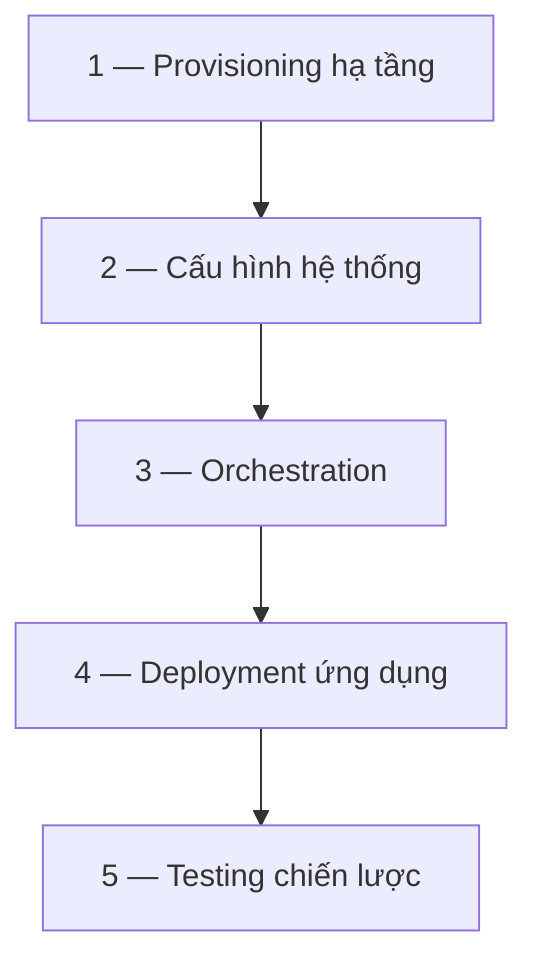

# IaC toolchain

> [!summary] TL;DR
> Không có "tool tốt nhất", chỉ có **tool phù hợp với team & tình huống** — và bạn không chọn một tool mà **thiết kế cả toolchain** (lên kế hoạch như xây ứng dụng). Các lớp quyết định: **Provisioning** (template-driven: CloudFormation/ARM; ngôn ngữ riêng đa-cloud: **Terraform/Pulumi**; thuần code: boto/CDK/Bicep) → **Config management** (runtime: **Chef/Puppet/CFEngine**; có orchestration: **Ansible/Salt**) hoặc **baking image** (**Packer**, Dockerfile → immutable) → **Orchestration** (trong CM tool; platform như **Kubernetes**; runbook như Rundeck) → **Deployment** (CM / immutable container / CD system) → **Testing** (unit/integration test cho cả code hạ tầng). Quy tắc: *pick the right tool, keep it simple, integrate well*.

---

## 1. Tiến hoá CM tool (bối cảnh)

| Thời kỳ | Tool tiêu biểu | Cơ chế |
|---|---|---|
| 1990s | Ghost (clone), Tivoli/HP suite | clone image / suite enterprise |
| 2000s | **CFEngine, Puppet, Chef** | declarative idempotent DSL, **pull** (server tự tỉnh dậy mỗi ~15' kéo config) |
| 2010s | **Ansible, SaltStack** | **push** + orchestration tường minh (vd: đổi schema DB → rolling deploy app → đổi DNS) |
| 2010s+ | **Terraform, Pulumi, CloudFormation** | provision *hạ tầng* từ code (cloud) |
| 2020s | **Docker + Kubernetes** | container immutable + orchestration gói chung |

> Vấn đề của pull-CM (Puppet/Chef): mặc định mỗi server tự cập nhật độc lập → tốt cho lab, **không** ổn cho hệ phân tán cần phối hợp (không để tất cả app server cùng down). ⇒ sinh ra push-tool có orchestration (Ansible/Salt).

---

## 2. Các lớp quyết định khi dựng toolchain



### 2.1. Provisioning — chọn theo "độ mạnh"

| Cách | Tool | Đặc điểm |
|---|---|---|
| **Template-driven** | AWS **CloudFormation**, Azure **ARM** | định nghĩa hạ tầng bằng JSON/YAML đơn giản |
| **Ngôn ngữ riêng, đa-cloud** | **Terraform**, **Pulumi** | DSL mạnh, chạy qua nhiều cloud provider |
| **Thuần code** | Python **boto**, AWS **CDK**, Azure **Bicep** | dùng ngôn ngữ lập trình đầy đủ (đánh đổi: kém idempotent hơn chút) |

### 2.2. Quản lý hệ thống — cấu hình runtime vs baking image

- **Cấu hình runtime:** base OS image + **Chef/Puppet/CFEngine** (hoặc **Ansible/Salt** kèm orchestration) cấu hình server khi chạy.
- **Baking image:** tạo image dựng sẵn — **HashiCorp Packer** ("bake" VM image), hoặc **Dockerfile** (bake container image, hạt mịn hơn) → **immutable deployment**.
- **Chain được:** vd cấu hình base bằng Chef → bake bằng Packer. *Baking dời thời gian & rủi ro về sớm trong chu trình, nhưng mất linh hoạt ở production.*

### 2.3. Orchestration & Deployment

| Nhu cầu | Lựa chọn |
|---|---|
| Orchestration nằm trong CM tool | Ansible / Salt |
| Orchestration là tính năng platform | **Kubernetes** / Mesos |
| Runbook tự động bên ngoài | Rundeck / custom code |
| Deploy app | CM tool · bake vào container + immutable deploy · hoặc dùng CD system |

### 2.4. Testing — "không test thì không phải đang code"

Hầu hết tool IaC có test framework: **unit test** code hạ tầng + **integration test** hạ tầng tạo ra (thường biến thể RSpec: InSpec, ChefSpec). Mọi thứ chạy qua CI pipeline → [[09-CI-CD-Continuous-Deployment]].

> [!example] Toolchain thực tế (khoá học)
> SaaS bảo mật trên AWS: **Terraform** dựng network & server nền → **Puppet** cấu hình base image → **Packer** bake image → **Rundeck** chạy upgrade (Terraform update hạ tầng + Puppet update app); Puppet chạy *read-only* để **drift detection**; mọi thứ qua CI test code app + code hạ tầng + runbook. Hệ thống đơn giản hơn cùng nơi: **CloudFormation** dựng nền + **Dockerfile** bake container → đẩy lên managed container service tự orchestrate → chỉ cần template + Dockerfile + build job.

> [!question] Phỏng vấn: "Terraform khác Ansible/Puppet ở vai trò nào?"
> Chúng giải **bài toán khác nhau**. **Terraform** (và CloudFormation/Pulumi) chuyên **provisioning hạ tầng** — tạo server/network/storage từ code, declarative. **Puppet/Chef** chuyên **configuration management** runtime — cấu hình OS & app *bên trong* server theo desired state (pull, idempotent). **Ansible** thiên về **config + orchestration** kiểu push (điều phối thứ tự thao tác). Thực tế hay **kết hợp**: Terraform dựng hạ tầng → Puppet/Ansible cấu hình. Hiểu ranh giới provisioning/deployment/orchestration ([[07-IaC-Concepts]]) là chìa khoá chọn đúng.

> [!question] Phỏng vấn: "Baking image (immutable) khác cấu hình runtime thế nào? Đánh đổi?"
> **Cấu hình runtime** (Puppet/Chef chạy trên server đang sống) linh hoạt, sửa tại chỗ — nhưng dễ drift. **Baking** tạo image/container hoàn chỉnh (Packer/Dockerfile) rồi deploy **immutable** (không sửa, chỉ thay mới) — loại bỏ drift, rollback dễ, nhưng **dời rủi ro & thời gian về sớm** và **mất linh hoạt ở production**. Container đẩy mạnh hướng immutable vì build container mới rẻ & nhanh.

```
★ Insight ─────────────────────────────────────
• Pull (Puppet/Chef) vs Push (Ansible/Salt) là khác biệt kiến trúc quyết định khả
  năng ORCHESTRATION: pull tốt cho fleet độc lập, push tốt khi cần phối hợp thứ tự
  (đổi DB trước, rolling app sau).
• Kubernetes hấp dẫn vì gói cả 3 bài toán (provision/deploy/orchestrate) vào một —
  nhưng đánh đổi bằng độ phức tạp khổng lồ (note 12).
• "Thiết kế toolchain, đừng nhặt tool" là tư duy then chốt: chọn tool theo END
  STATE mong muốn (deployment) rồi cascade ngược về build — giống cách xếp lớp
  hành tây trong CI toolchain (note 09).
─────────────────────────────────────────────────
```

---

## 3. Tự kiểm tra

1. Ba nhóm tool provisioning (theo độ mạnh) và ví dụ mỗi nhóm?
2. Pull-CM khác push-CM ra sao? Vì sao push hợp với hệ phân tán hơn?
3. Baking image (Packer/Docker) đánh đổi gì so với cấu hình runtime?
4. Terraform vs Puppet vs Ansible — mỗi cái mạnh ở phần nào của CM?
5. Vì sao cần test cho code hạ tầng?

---

## 4. Liên quan
- [[07-IaC-Concepts]] — provisioning/deployment/orchestration, idempotent, immutable
- [[12-Modern-DevOps]] — Kubernetes & Cloud native chi tiết
- [[09-CI-CD-Continuous-Deployment]] — pipeline chạy test cho IaC
- [[05-Cloud/02-Azure/13-Cong-cu-quan-ly-CLI-ARM-Arc]] — ARM/Bicep trên Azure
- [[05-Cloud/02-Azure/07-Compute-VM-Container-Functions]] — compute nền cho deploy
- [[00-MOC-DevOps|MOC: DevOps]]
