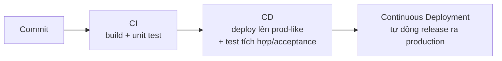

# Continuous Integration / Delivery / Deployment

> [!summary] TL;DR
> Ba khái niệm thường bị lẫn — chúng là **pipeline** nối tiếp build → deploy → release. **CI (Continuous Integration):** tự động **build + unit test toàn bộ app** trên *mỗi commit* → app luôn ở trạng thái chạy được. **CD (Continuous Delivery):** thêm bước **deploy mỗi thay đổi lên môi trường giống production** + test tích hợp/acceptance tự động → app luôn **sẵn sàng release**. **Continuous Deployment:** **tự động release thẳng ra production** sau khi test pass (Amazon/Meta/Google dùng). Sáu thực hành CI: build nhanh (coffee test), commit nhỏ, không để build hỏng, **trunk-based + feature flags**, không có test "flaky", build trả về **status + log + artifact**. Năm thực hành CD: artifact **build một lần** dùng mọi môi trường, artifact **immutable**, pre-prod **giống hệt prod**, **dừng pipeline khi hỏng**, deploy **idempotent**. **Secret trong pipeline:** không hardcode vào repo (Git giữ cả lịch sử → lộ là vĩnh viễn), cất trong kho mã hoá (Vault/Secrets), inject lúc chạy + mask log, least-privilege + rotate, lý tưởng dùng **OIDC** (token ngắn hạn, bỏ key dài hạn); quét bằng **gitleaks/trufflehog**.

---

## 1. Ba khái niệm — đừng nhầm



| Khái niệm | Làm gì | Trạng thái đảm bảo |
|---|---|---|
| **Continuous Integration** | tự động build + unit test toàn app trên **mỗi check-in** | app luôn **chạy được** |
| **Continuous Delivery** | + deploy mỗi change lên **prod-like env** + test tích hợp/acceptance tự động | app luôn **release-ready** |
| **Continuous Deployment** | + **tự động release** ra production khi test pass | thay đổi ra production **liên tục** |

> CI/CD thường viết gộp cho cặp CI + Continuous Delivery. **Continuous Deployment** là bước "pro" cuối cùng — *không bắt buộc*: có thể vẫn cần một bước duyệt tay / product manager sign-off / gom batch. Nếu CI & CD tốt thì làm Continuous Deployment an toàn (approval/test thành step trong pipeline; **feature flags** cho code đã deploy nhưng ẩn với user).

---

## 2. Sáu thực hành Continuous Integration

Trên mỗi commit, CI tự động: lấy toàn code → build → chạy mọi unit test & validation → đóng gói **artifact** + **status** + **log**. Bất kỳ bước nào fail → **build broken** → cả team bị chặn cho tới khi sửa.

| # | Thực hành | Vì sao |
|---|---|---|
| 1 | **Build chạy nhanh** | "coffee test" — dưới ~5 phút. Build chậm → người ta gom batch lớn → WIP cao |
| 2 | **Commit nhỏ** | dễ suy luận, dễ cô lập lỗi |
| 3 | **Không để build hỏng** | build hỏng = chặn giao hàng; văn hoá: dừng việc để sửa build |
| 4 | **Trunk-based development** | không nhánh sống lâu; thay đổi nhỏ vào trunk nhiều lần/ngày; **feature flags** để ẩn tính năng chưa xong (thay vì nhánh dài) |
| 5 | **Không có test "flaky"** | test lúc pass lúc fail vô cớ → mất niềm tin vào CI; phải sửa |
| 6 | **Build trả về status + log + artifact** | status (pass/fail) · log (troubleshoot/compliance) · artifact (bản cài được, tag theo build number → audit & immutable) |

> [!note] Trunk-based vs Branch-based
> **Branch-based:** mỗi dev giữ nhánh dài, làm cả tính năng lớn rồi merge → nhánh càng dài càng khó merge. **Trunk-based** (đặc trưng đội high-performer theo DORA): không nhánh sống lâu, commit nhỏ vào trunk nhiều lần/ngày, trunk luôn cập nhật. Tính năng lớn chưa muốn lộ → **feature flag** thay vì nhánh dài. → [[00-Foundations/02-Git/05-Branch-Merge-PR]].

---

## 3. Năm thực hành Continuous Delivery

Sau build là **deployment stage** — deploy artifact thành công lên env giống production nhất (staging/test/pre-prod), rồi test tự động tối đa.

| # | Thực hành | Chi tiết |
|---|---|---|
| 1 | **Build artifact một lần** | RPM/Deb/MSI/WAR/ZIP… build *một lần*, dùng cho **mọi** môi trường (test = production) |
| 2 | **Artifact immutable** | không đổi giữa các stage; chỉ CI ghi, deploy chỉ đọc → **checksum** chứng minh cùng bản → tin cậy & **auditability** (truy được source → artifact → hệ thống chạy) |
| 3 | **Pre-prod giống hệt prod** | gồm load balancer, network, security control, data khớp prod → acceptance/smoke/integration test đáng tin |
| 4 | **Dừng pipeline khi hỏng** | build hỏng → đừng deploy; deploy hỏng → đừng release. Tối ưu **flow tổng thể**, không tối ưu từng cá nhân |
| 5 | **Deploy idempotent** | chạy bao nhiêu lần cũng ra cùng hệ thống (qua container immutable hoặc CM tool) |

---

## 4. Vai trò QA & các loại test (test pyramid)

Tự động hoá test là **điều kiện sống còn** của CI/CD. Vẫn cần người giỏi QA — nhưng để **thiết kế & viết test** cùng dev, *"để máy làm việc click chuột"*. Manual test chỉ dùng cho acceptance cuối (có thể).

```
        /\        Acceptance / E2E (chậm, UI: Selenium, Cypress)
       /  \       Integration (component + dependency)
      /----\      Code hygiene (linter/formatter: ESLint)
     /______\     Unit test (nhanh nhất, dev viết, chạy trên máy dev)
```

- **TDD/BDD:** viết test/hành vi mong muốn **trước** khi viết code → tạo test suite toàn diện trong lúc phát triển.
- **Test chậm** (browser compat, compliance lớn): chạy **song song**, hoặc **scheduled** (nightly), hoặc **liên tục** trên test env — cân nhắc *cost of delay* vs *cost of bug*. → [[02-Backend/10-Testing-Pytest]].

---

## 5. Release stage & Production Release Patterns

Release = đánh dấu artifact đã "released" tại thời điểm, rồi deploy ra production + notify. Cần **an toàn, reversible, không downtime**:

| Pattern | Cách làm |
|---|---|
| **Rolling deployment** | nâng cấp **từng** server trong nhiều server giống nhau → chuyển traffic mượt |
| **Blue-Green** | dựng nguyên hệ mới (Green), **cắt** traffic từ Blue → Green (rollback = cắt ngược) |
| **Canary** | nâng cấp **một** server, chạy thử dưới tải production xem có lỗi không |
| **A/B deployment** | feature flag mở tính năng cho **một nhóm user** (canary ngắn hoặc public beta dài) |

> [!question] Phỏng vấn: "Phân biệt Continuous Integration, Delivery và Deployment."
> **CI** = tự động **build + unit test** toàn app trên *mỗi commit* → app luôn chạy được. **Continuous Delivery** = thêm **deploy lên môi trường giống production + test tích hợp/acceptance tự động** → app luôn **sẵn sàng release** (nhưng nút release cuối có thể là tay). **Continuous Deployment** = **tự động release thẳng ra production** sau khi test pass, không cần can thiệp tay. Câu chốt: *Delivery làm app "release-ready"; Deployment thực sự "release" tự động.*

> [!question] Phỏng vấn: "Blue-Green khác Canary thế nào?"
> **Blue-Green**: dựng **toàn bộ** môi trường mới (Green) song song với hiện tại (Blue), rồi **cắt toàn bộ traffic** sang Green; rollback nhanh bằng cắt ngược. **Canary**: chỉ nâng cấp **một phần nhỏ** (một vài server / % user) và quan sát dưới tải thật trước khi rollout phần còn lại. Blue-Green tối ưu *rollback tức thì & không downtime*; Canary tối ưu *giảm bán kính ảnh hưởng* khi phát hiện lỗi sớm. A/B là canary dựa trên feature flag theo nhóm user.

```
★ Insight ─────────────────────────────────────
• Artifact "build once, run everywhere" + immutable là nền của AUDITABILITY: truy
  ngược source commit → build artifact → hệ thống production. Rebuild giữa chừng
  phá vỡ chuỗi tin cậy này.
• "Dừng pipeline khi hỏng" gây khó chịu CÓ CHỦ ĐÍCH: nó ép cả team tối ưu flow
  tổng thể (Way 1) thay vì để mỗi người tự đi tiếp với rủi ro tích luỹ.
• CI/CD là hiện thân kỹ thuật của Way 2 (feedback) + Visible Ops (change nhỏ, test
  sớm): cùng một triết lý, ba lớp trừu tượng khác nhau.
─────────────────────────────────────────────────
```

---

## 6. CI toolchain (lớp hành tây — từ ngoài vào trong)

Thiết kế từ **end state** (deployment) ngược về version control:

| Lớp | Vai trò | Tool ví dụ |
|---|---|---|
| Deployment (ngoài cùng) | cách app chạy & rollout | feature flag: LaunchDarkly/Split; K8s/Serverless built-in |
| Artifact repository | lưu artifact | Artifactory, Nexus, container registry, S3 (MVP) |
| Testing | unit/lint/integration/e2e/security | go test, ESLint, Pytest, Selenium, Dependabot |
| Build system | thực thi build & kích pipeline | **Jenkins**, CircleCI, **GitHub Actions** |
| Version control (lõi) | commit & lịch sử | **Git** (GitHub/GitLab/Bitbucket) |

> Đo **cycle time** (1 thay đổi đi từ máy dev → production), ghi-graph-chia sẻ; cố làm giảm nó. → công cụ CI/CD chi tiết: [[00-Foundations/02-Git/13-GitHub-Actions]].

---

## 7. Secrets trong CI/CD (quản lý bí mật trong pipeline)

**Secret** (bí mật) = bất kỳ chuỗi nhạy cảm nào không được lộ: API key (khoá API), DB password (mật khẩu cơ sở dữ liệu), access token (mã truy cập), cloud credential (thông tin đăng nhập cloud — `AWS_SECRET_ACCESS_KEY`…), private signing key (khoá ký riêng). Pipeline CI/CD **bắt buộc** dùng chúng để deploy (đăng nhập registry, đẩy lên cloud, chạy migration) — nên đây là điểm rò rỉ kinh điển.

> [!danger] Quy tắc số 1: KHÔNG hardcode secret vào code/repo
> Hardcode = ghi cứng giá trị thẳng trong mã nguồn (vd `API_KEY = "sk-abc123..."`). Repo Git lưu **toàn bộ lịch sử** → xoá ở commit sau **không** xoá khỏi lịch sử; ai clone về vẫn `git log -p` ra được. Với **repo public** thì coi như lộ ngay lập tức (bot quét GitHub trong vài giây → bị lạm dụng billing). File `.env` chứa secret phải nằm trong `.gitignore`, **không bao giờ** commit.

### 7.1 Vòng đời secret an toàn — Store → Inject → Mask → Rotate

| Bước | Làm gì | Công cụ / cách |
|---|---|---|
| **Store** (lưu) | giữ secret trong **kho mã hoá** riêng, ngoài repo | GitHub Actions Secrets, GitLab CI Variables (masked/protected), HashiCorp **Vault**, AWS Secrets Manager / **KMS**, Azure **Key Vault**, GCP Secret Manager |
| **Inject** (tiêm) | bơm secret vào job **lúc chạy** dưới dạng biến môi trường, không ghi ra file commit được | `${{ secrets.MY_KEY }}` (GitHub Actions) → `env:` của step |
| **Mask** (che) | che giá trị secret trong **log** thành `***` | runner tự mask secret đã đăng ký; **đừng** `echo`/`print` secret ra log |
| **Least privilege** | token chỉ cấp đúng quyền tối thiểu, đúng phạm vi (scope) | deploy key chỉ-đọc-1-repo; IAM role hẹp |
| **Rotate** (xoay vòng) | đổi secret định kỳ + ngay khi nghi lộ | rotation policy; ưu tiên **token ngắn hạn** |

### 7.2 OIDC — bỏ hẳn long-lived key (cách hiện đại)

Thay vì cất sẵn `AWS_ACCESS_KEY` **dài hạn** trong CI (lộ là toang, lại phải rotate tay), pipeline dùng **OIDC** (OpenID Connect — giao thức liên kết danh tính): runner CI tự xuất trình một **token ngắn hạn** có chữ ký, cloud xác minh "đúng repo/branch này" rồi cấp **credential tạm thời** (sống vài phút). Hết job là hết hạn → **không có gì dài hạn để lộ**. GitHub Actions ↔ AWS/Azure/GCP đều hỗ trợ.

> [!warning] Bẫy thường gặp khi xử lý secret
> - **`echo $SECRET` ra log** → log CI thường ai trong team cũng xem được, mask không cứu được mọi định dạng (vd secret bị base64/biến đổi).
> - **Secret trong Docker `ARG`/`ENV`** → bị **bake (nướng) vào layer image**; ai `docker history` / pull image về đều moi ra. Dùng **BuildKit secret mount** (`RUN --mount=type=secret`) hoặc multi-stage để secret không dính vào layer cuối. → [[06-DevOps/13-Docker-Practical]].
> - **Pull Request từ fork** đọc được secret → cấu hình để workflow của fork **không** nhận secret của repo gốc (GitHub mặc định chặn; đừng tự mở).
> - **Secret in CI ≠ secret in app runtime**: secret để *deploy* (đẩy lên cloud) khác secret app *chạy* cần (DB pass) — cái sau nên lấy từ secret manager **lúc app khởi động**, không nhồi hết vào pipeline.

### 7.3 Phát hiện rò rỉ — secret scanning

Phòng tuyến cuối: quét secret tự động để chặn/báo động khi có ai lỡ commit.

| Khi nào | Công cụ |
|---|---|
| **Trước khi commit** (pre-commit hook) | `gitleaks`, `git-secrets` chạy local chặn ngay |
| **Trong pipeline** (mỗi PR) | `gitleaks`/`trufflehog` như một step → fail build nếu thấy pattern key |
| **Trên nền tảng** | GitHub **Secret Scanning** + Push Protection (chặn push chứa key đã biết); Dependabot |

> [!question] Phỏng vấn: "Bạn quản lý secret trong CI/CD pipeline thế nào?"
> Tôi **không bao giờ** hardcode secret vào code hay commit `.env` — repo Git giữ cả lịch sử nên lộ là vĩnh viễn. Secret được cất trong **kho mã hoá** (GitHub Actions Secrets / Vault / cloud Secret Manager), **inject** vào job dưới dạng biến môi trường lúc chạy và được **mask** trong log. Token theo nguyên tắc **least privilege** và **rotate** định kỳ; lý tưởng là bỏ key dài hạn, dùng **OIDC** để CI lấy credential ngắn hạn. Với Docker, tránh nhồi secret vào `ENV`/`ARG` (bị bake vào layer) mà dùng BuildKit secret mount. Cuối cùng đặt **secret scanning** (gitleaks/trufflehog + GitHub Push Protection) ở pre-commit và trong pipeline để chặn rò rỉ.

```
★ Insight ─────────────────────────────────────
• Git lưu LỊCH SỬ, không chỉ trạng thái hiện tại → một secret lỡ commit là sự cố
  "xoá không sạch": phải coi như đã lộ và ROTATE ngay, không chỉ git rm.
• OIDC lật ngược mô hình bảo mật: thay vì "giữ bí mật thật giỏi" (long-lived key),
  ta "không giữ bí mật nào cả" (short-lived, cấp theo nhu cầu) → không còn thứ để
  trộm. Đây là nguyên lý zero-standing-credential.
• Secret là điểm giao của CI/CD với DevSecOps: pipeline tự động hoá tốc độ, nhưng
  chính tốc độ đó khuếch đại hậu quả khi một secret lọt vào artifact phát tán rộng.
─────────────────────────────────────────────────
```

---

## 8. Tự kiểm tra

1. Phân biệt CI, Continuous Delivery, Continuous Deployment.
2. Kể 6 thực hành CI. "Coffee test" là gì?
3. Trunk-based khác branch-based ra sao? Feature flag giải quyết vấn đề gì?
4. Vì sao artifact phải build một lần & immutable?
5. Phân biệt Rolling / Blue-Green / Canary / A/B deployment.
6. Vì sao không được hardcode secret vào repo? Lỡ commit rồi `git rm` đã đủ chưa?
7. Vòng đời secret an toàn gồm những bước nào (Store → ... → Rotate)? OIDC giải quyết vấn đề gì so với long-lived key?

---

## 9. Liên quan
- [[06-Visible-Ops-Change-Control]] — change nhỏ + test sớm (nền của CI)
- [[10-SRE-Reliability]] — deploy an toàn & MTTR
- [[00-Foundations/02-Git/12-CI-CD-la-gi]] — CI/CD cơ bản
- [[00-Foundations/02-Git/13-GitHub-Actions]] — pipeline thực hành
- [[06-DevOps/13-Docker-Practical]] — secret trong Docker build (đừng bake vào layer)
- [[02-Backend/10-Testing-Pytest]] — viết test (unit/integration)
- [[00-MOC-DevOps|MOC: DevOps]]
